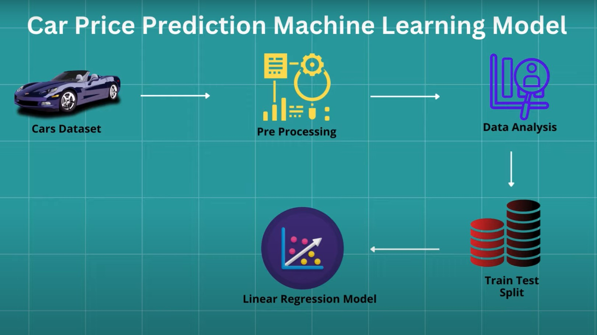

# 🚗 Car Price Prediction Using Linear Regression(Beginner) 

Predicting the prices of used cars based on their features using linear regression.

---

## 📈 Project Overview

In this project, we develop a predictive model to estimate the selling price of used cars based on various features like mileage, year of manufacture, and engine size. We employ linear regression as the primary modeling technique to achieve accurate price predictions.

---

## Screenshot

Here's a glimpse of the project in action:

---

## 🌟 Features

- **Data Cleaning and Preprocessing**: Handle missing values and encode categorical data.
- **Feature Engineering**: Create meaningful features to improve model performance.
- **Linear Regression Model**: Build and train a linear regression model to predict car prices.

---

## 📊 Data

The dataset used in this project contains the following features:

- **`name`**: The brand and model of the car.
- **`year`**: The manufacturing year of the car.
- **`km_driven`**: The total kilometers driven by the car.
- **`fuel`**: The type of fuel used by the car (e.g., Petrol, Diesel).
- **`seller_type`**: The type of seller (e.g., Individual, Dealer).
- **`transmission`**: The transmission type (e.g., Manual, Automatic).
- **`owner`**: The number of previous owners.
- **`mileage`**: The mileage of the car in kmpl or km/kg.
- **`engine`**: The engine capacity of the car in cc.
- **`max_power`**: The maximum power output of the car in bhp.
- **`seats`**: The number of seats in the car.

